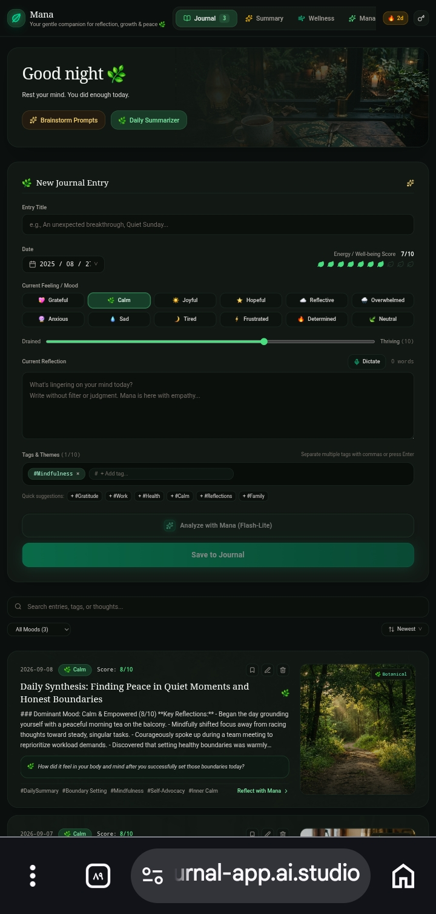
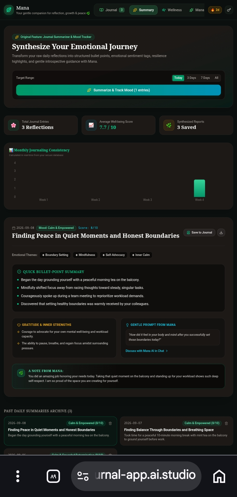
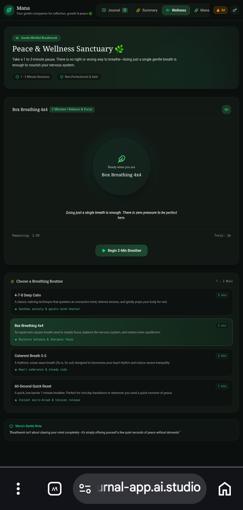
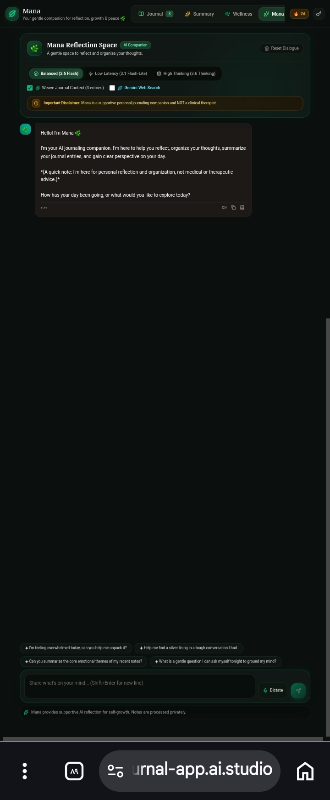

##  Mana: Empathetic AI Journal & Self-Reflection Companion

**Google Cloud Run AI Hackathon Submission**  
**Developed by:** Zahra Khorram 


---

## 📣 Elevator Pitch

Mana is a calm, AI-powered personal journal designed to make digital reflection feel more mindful and human. Instead of focusing on fast-paced productivity, Mana introduces the idea of Positive Friction in Human-Computer Interaction (HCI) by encouraging users to pause, breathe, and reflect before writing.


Powered by Gemini, Mana acts as a supportive reflection companion rather than simply generating text, helping users explore their thoughts and emotions through a more thoughtful interaction.
---

## 🔗 Live Demo & Links

* **Interactive Prototype:** [ https://mana-ai-journal-app.ai.studio/ )
  -
* **GitHub Repository:** [Mana Repository](https://github.com)
  _
**Video Demo (LinkedIn):** [Watch Demo Video on LinkedIn](https://lnkd.in/p/eZENQcwu)
  _
* 📝 **Medium Article:** [Read the Case Study](https://zahrakhorram2314.medium.com/mana-where-psychology-meets-ai-for-better-self-reflection-51b767ed5996)
---

## 📸 Application Preview & Core Features

| 📝 New Journal Entry | 📊 Emotional Summary Dashboard |
| :---: | :---: |
|  |  |

| 🧘 Peace & Wellness Sanctuary | 💬 Mana Reflection Space |
| :---: | :---: |
|  |  |

---

## 🛠️ Technical Architecture & Google Cloud Integration

Mana is built strictly adhering to cloud-native architectural standards, ensuring high performance, zero-hallucination guardrails, and data security:

* **🧠 Gemini API (Empathetic Engine):** Powers the core conversational interface and journal synthesis. Gemini analyzes daily entries to extract key themes, emotional trends, and provides gentle, constructive feedback without clinical overstepping.
* **🔓 Friction-Free Judge Access (Demo Architecture):** For this hackathon evaluation, Firebase Authentication was intentionally omitted to provide judges with immediate, zero-friction access to all application features without requiring account creation.
* **📊 Google Cloud Firestore (Real-Time Database):** Securely stores journal entries, structured emotional reflections, and conversation history in real time.
* **🔐 Google Cloud Secret Manager:** Safeguards critical environmental variables, including the Gemini API keys and Firebase configurations, preventing any credential exposure.
* **🚀 Google Cloud Run:** Containerized deployment for scalable, low-latency microservices.

---

## 🌟 Core Features & UX Philosophy

Guided Emotional Reflection

Instead of a blank screen, Mana greets users with breathing exercises, such as 4-4-4 Box Breathing, to help users pause and settle before writing.

AI-Powered Synthesis

Mana uses Gemini to transform journal entries into structured emotional insights, highlighting resilience and providing gentle prompts for further reflection.

Privacy & Safety by Design

Mana operates as a supportive journaling companion with clear boundaries, designed to support self-reflection and emotional wellbeing rather than serve as a medical therapist.

Mindful AI Persona


Carefully designed system instructions guide Gemini to provide warm, non-judgmental responses that are sensitive to the user's current context.
---

## 🛡️ Responsible AI & Ethical Guardrails

Mana AI is built in explicit alignment with **Google’s Responsible AI Principles**, ensuring that generative capabilities serve human well-being safely and transparently.

* **Non-Clinical Boundary (Safety & Social Benefit):** Designed strictly for supportive self-reflection and daily journaling. Systematic system instructions explicitly prevent the model from providing psychiatric diagnoses, clinical advice, or acting as a licensed therapist.
* **Privacy by Design:** User interaction data and reflection logs are isolated and secured using **Google Cloud Firestore Security Rules** and **GCP Secret Manager**, ensuring sensitive personal notes are never exposed or misused.
* **Cognitive Load & Ergonomics:** Grounded in cognitive psychology, the prompt architecture avoids overwhelming text generation, using structured, calm, and empathetic framing to minimize user mental friction.
* **Human-in-the-Loop & Agency:** The AI acts strictly as a reflective co-pilot, leaving all emotional evaluation and decision-making fully in the hands of the user.
___

## 🗺️ Future Roadmap
* 🎨 **Figma Interactive Prototypes:** Complete high-fidelity UI design flows and micro-interactions.
* 📊 **Mood Trend Insights:** Introduce non-intrusive, privacy-first emotional reflection patterns over time.
* 🌍 **Localization:** Expand prompt architecture for multi-language cognitive UX support.

___


### 💻 How to Run Locally

**1. Clone the repository:**

```bash
git clone https://github.com/zahrakhorram2314-del/mana_ai/edit/main/README.md
cd mana_ai

npm install
npm run dev

___

## 📜 License
Distributed under the MIT License.

